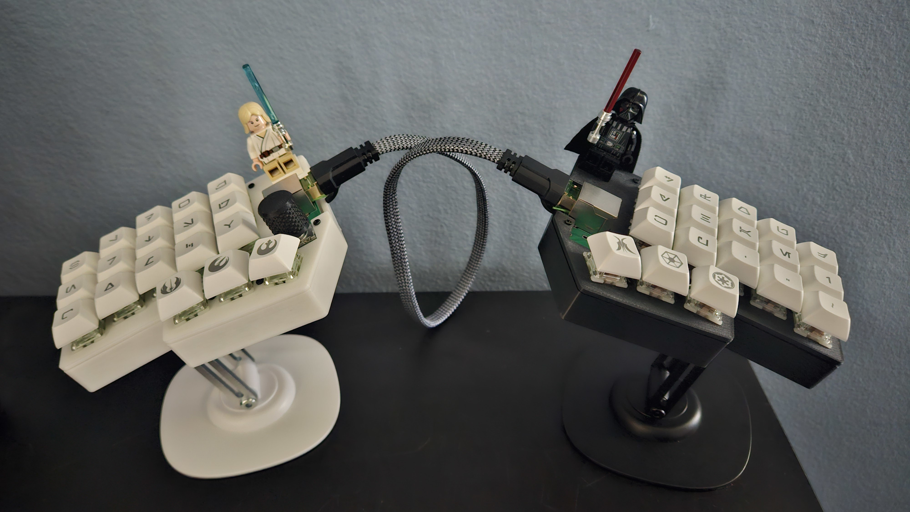
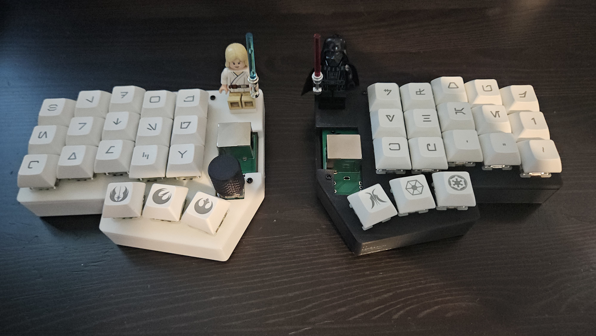

# the kablammer

A 36-key split ergo keeb to optimize your efficiency in dynamic heuristic analysis, improving synergy and interpolation of functional pseudo-discrete technical shizzle wizzles. Guaranteed to make you a 1000x front/back/middle end full stack vibe coded prompt engineer or your money back.

Features:
- [x] Reversible PCB
- [x] RP2040 zero microcontrollers (cheap + uses USB C)
- [x] Rotary encoder for volume or scrollwheel
- [x] RJ45 connects the two halves
- [x] Can seat two minifigures for moral support during intense debugging sessions

Case is made in FreeCAD. I just use the same model for both halves, but mirrored. The halves are not exactly the same, so you'll get slightly larger slots than necessary. I use a magsafe sticker on the bottom of each half. Then you can use magsafe phone stands for tenting.

Firmware is in [my QMK fork](https://github.com/sammy-kablammy/qmk_firmware.git).

